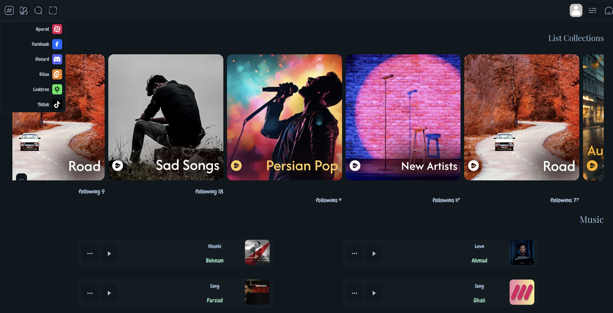
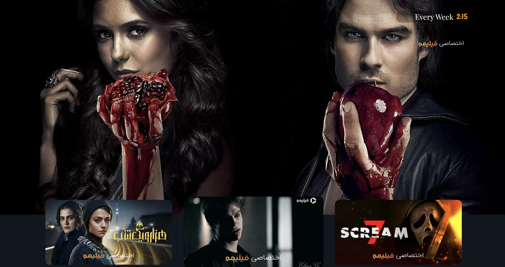
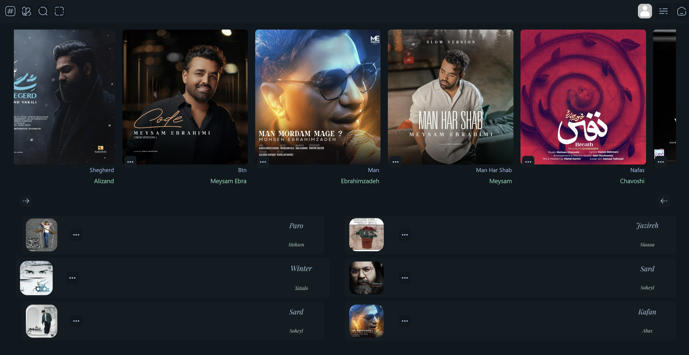

# 🎵 Music Store

> A beautifully crafted music store web app — where great tracks meet great design.

------

## 🌐 Live Demo

🔗 [Click here to visit the live site](https://poria-dev.github.io/Music-store/)

-----

## ✨ About The Project

Music Store is a modern and visually stunning front-end web project
dedicated to showcasing the hottest tracks and the finest Iranian music
arrangements (Aranye). 

This project was built with pure HTML5 and CSS3 — no frameworks,
no shortcuts — just clean, handcrafted code that proves you don't need
JavaScript to make something look incredible.

Whether you're a music lover or a developer looking for clean UI
inspiration, this project has something for you. 🎧

---

## 🚀 Features

- 🎨 Stunning Visual Design — Eye-catching layout with a music-first aesthetic
- 🎵 Music & Aranye Showcase — Highlights top Iranian music arrangements
- 📐 CSS Flexbox — Used for smooth, flexible component alignment
- 🔲 CSS Grid — Powers the structured, multi-column layout
- 🧹 Clean Codebase — Pure HTML & CSS, no dependencies
- ⚡ Fast Loading — Lightweight with zero JavaScript overhead
- 🌈 Custom Styling — Unique color palette and typography choices
- 🖥️ Desktop Optimized — Crafted for a rich desktop viewing experience

---

## 🖼️ Screenshots

  

  

  

---

## 🛠️ Built With

| Technology | Purpose |
|------------|---------|
| HTML5 | Page structure & semantic markup |
| CSS3 | Styling, animations & layout |
| Flexbox | Component-level alignment |
| CSS Grid | Page-level layout system |

-----

